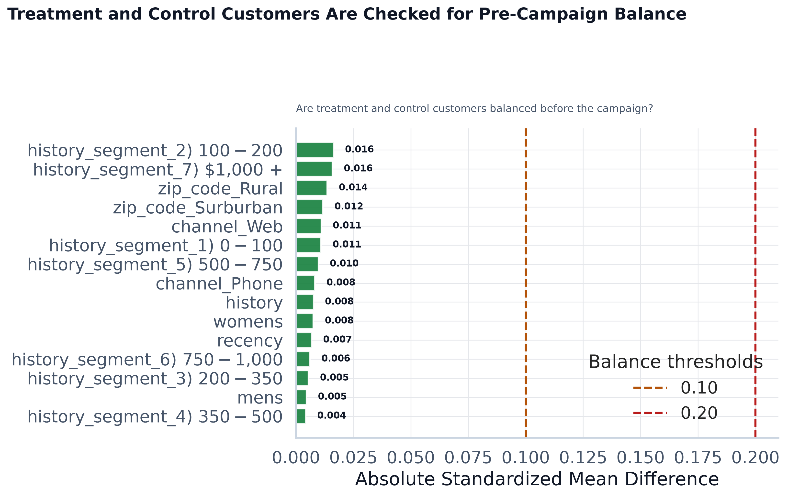
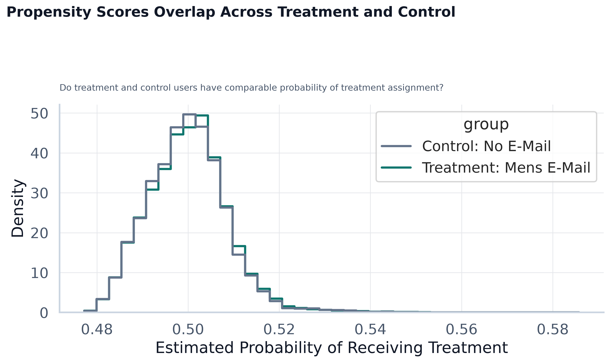
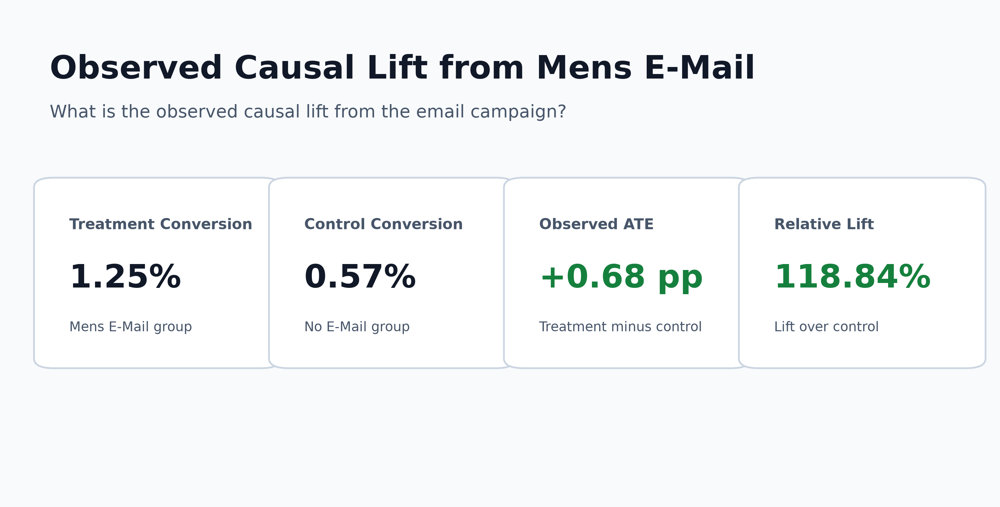
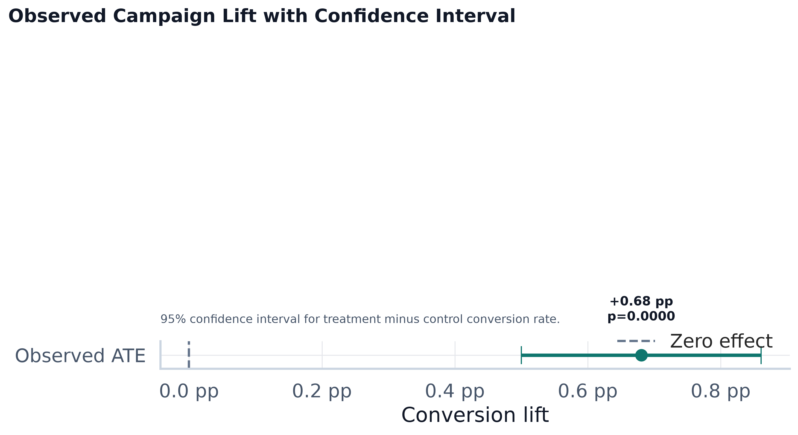
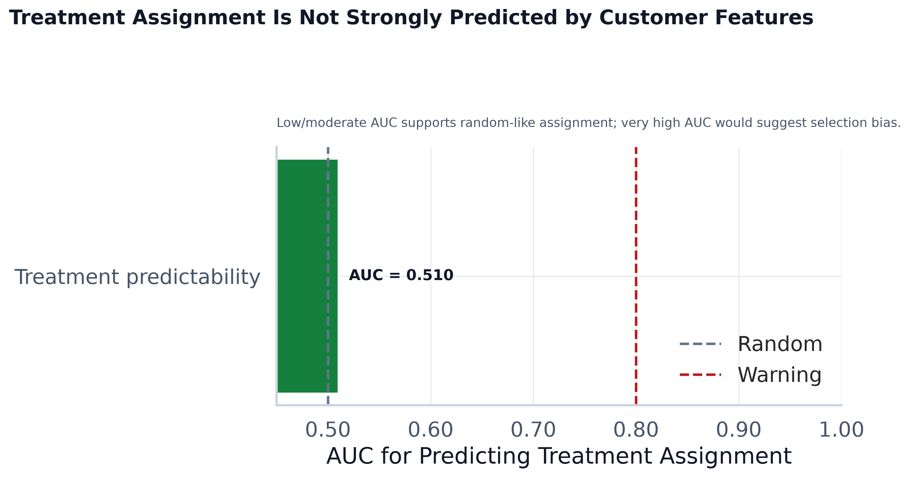

# Causal Validation Summary

## What Causal Validation Means

Causal validation checks whether the treatment-control comparison is credible before interpreting uplift as campaign impact. For PromoLift AI, this means checking whether customers who received the Mens E-Mail campaign look comparable to customers who received no email before the campaign.

## Why Treatment-Control Balance Matters

If treatment and control customers are balanced on pre-campaign features, then outcome differences are more plausibly caused by the campaign rather than by pre-existing customer differences. Because Hillstrom is a randomized marketing experiment, we expect strong balance.

## Observed Average Treatment Effect

- Treatment conversion rate: 1.25%
- Control conversion rate: 0.57%
- Observed ATE: 0.68 percentage points
- Relative lift: 118.84%
- Standard error: 0.0009
- 95% CI: 0.50% to 0.86%
- Two-proportion z-test p-value: 0.0000

The raw formula is treatment conversion rate minus control conversion rate. Because Hillstrom is a randomized experiment, this observed ATE is already meaningful as a campaign lift measure.

## Covariate Balance Findings

- Features checked: 18
- Good balance rows: 18
- Moderate imbalance rows: 0
- Notable imbalance rows: 0

Top absolute standardized mean differences:

| Feature | Type | Treatment Mean | Control Mean | Abs SMD | Balance |
|---|---|---:|---:|---:|---|
| history_segment_2) $100 - $200 | categorical | 0.220 | 0.227 | 0.016 | good balance |
| history_segment_7) $1,000 + | categorical | 0.022 | 0.020 | 0.016 | good balance |
| zip_code_Rural | categorical | 0.152 | 0.147 | 0.014 | good balance |
| zip_code_Surburban | categorical | 0.446 | 0.452 | 0.012 | good balance |
| channel_Web | categorical | 0.445 | 0.440 | 0.011 | good balance |
| history_segment_1) $0 - $100 | categorical | 0.363 | 0.357 | 0.011 | good balance |
| history_segment_5) $500 - $750 | categorical | 0.075 | 0.078 | 0.010 | good balance |
| channel_Phone | categorical | 0.434 | 0.438 | 0.008 | good balance |

Standardized mean differences below 0.10 are usually considered good balance. Values above 0.20 would be a stronger warning sign.

## Propensity Score Overlap

The propensity model AUC for predicting treatment assignment from pre-campaign features was 0.510. A low or moderate AUC suggests treatment assignment is not easily predictable from customer features. A very high AUC would warn that the treatment group may have been selected differently from control.

Because balance checks show very low SMD and propensity AUC near 0.5, the observed treatment-control difference is more credible than a generic observational comparison.

## DoWhy Result

DoWhy ran successfully using a simple backdoor propensity score matching estimator. The estimated effect was 0.64%. Refutation details are saved in `reports/causal/dowhy_results.json`.

Refutation status:
- Random common cause (`random_common_cause`): success
- Placebo treatment (`placebo_treatment_refuter`): success
- Subset refuter (`data_subset_refuter`): success

DoWhy refuters are interpreted as robustness checks:

- Random common cause refuter checks whether adding a random noise confounder changes the result.
- Placebo treatment refuter checks whether a fake treatment destroys the effect.
- Subset refuter, if supported by the installed DoWhy version, checks whether the estimate is stable on a subset.

## Limitations

These checks support the credibility of treatment-control comparisons, but they do not prove individual counterfactual outcomes. We still never observe the same customer both receiving and not receiving the campaign at the same time.

## Why This Strengthens Uplift Modeling

Uplift scores are used for customer ranking; causal validation supports whether treatment-control comparisons are credible. When balance, overlap, and observed ATE are reasonable, the uplift modeling story becomes more responsible and easier to defend.

## Charts

