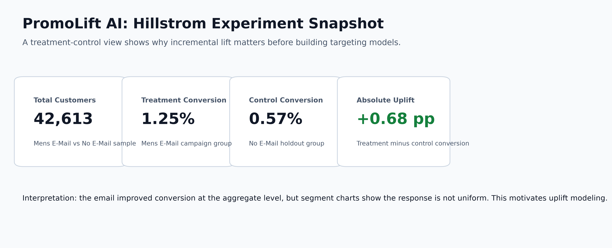
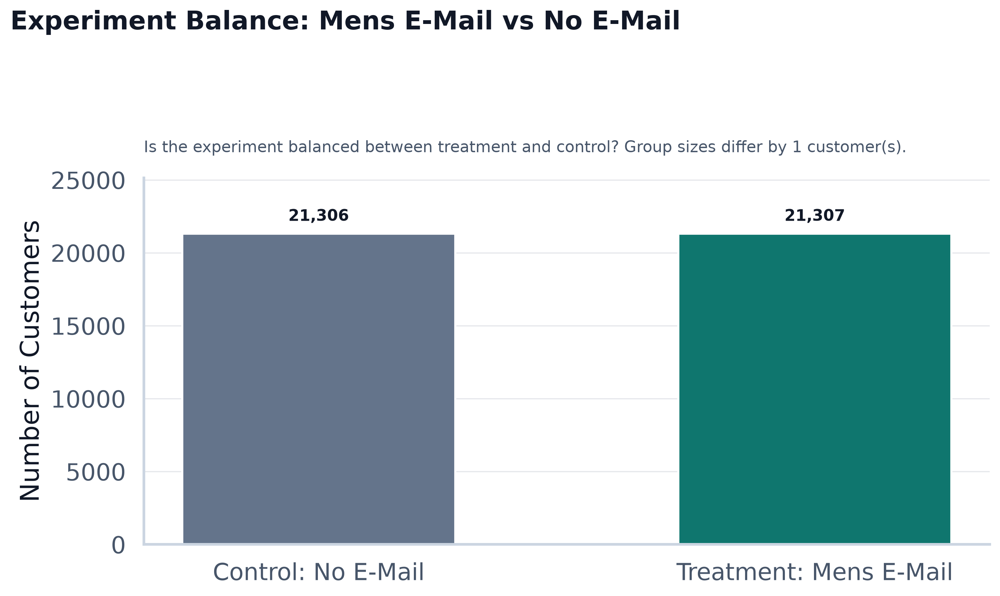
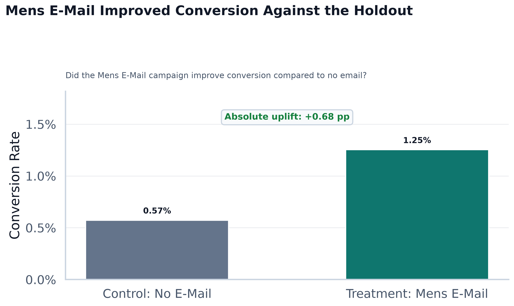
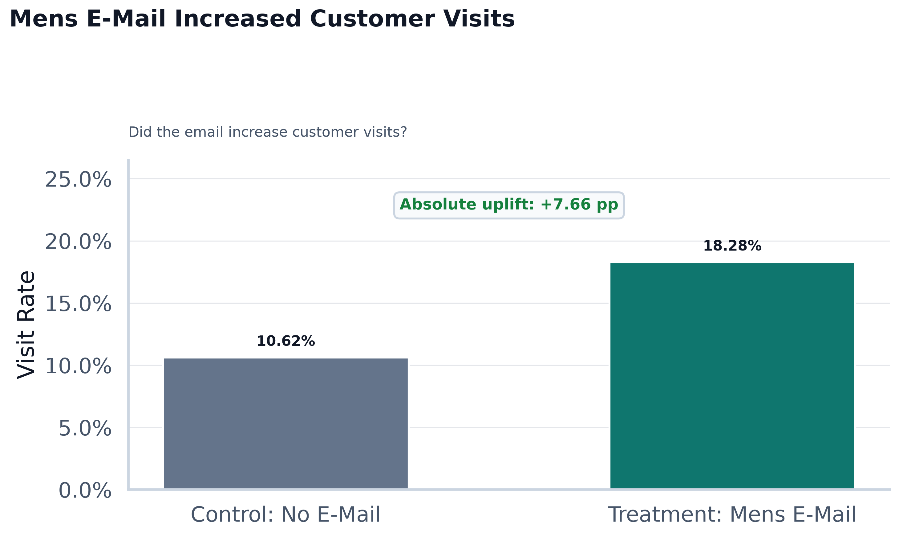
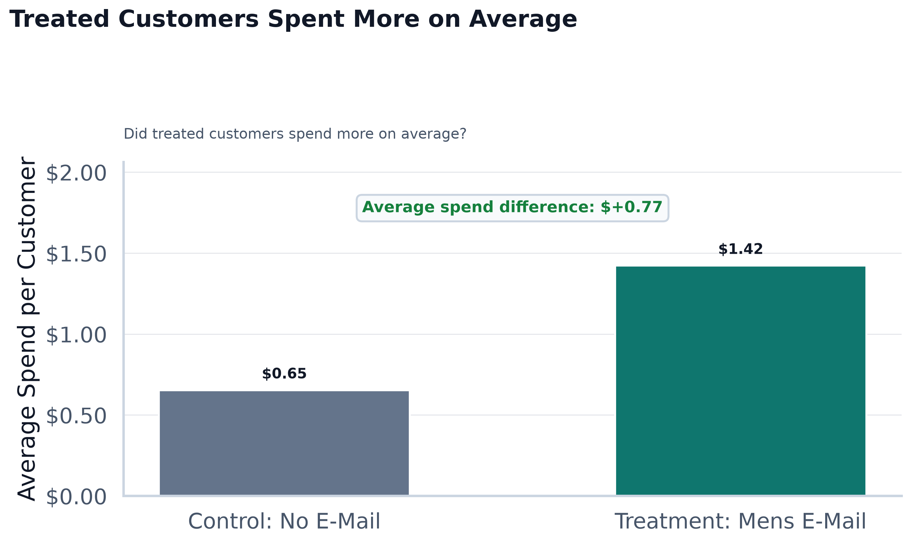
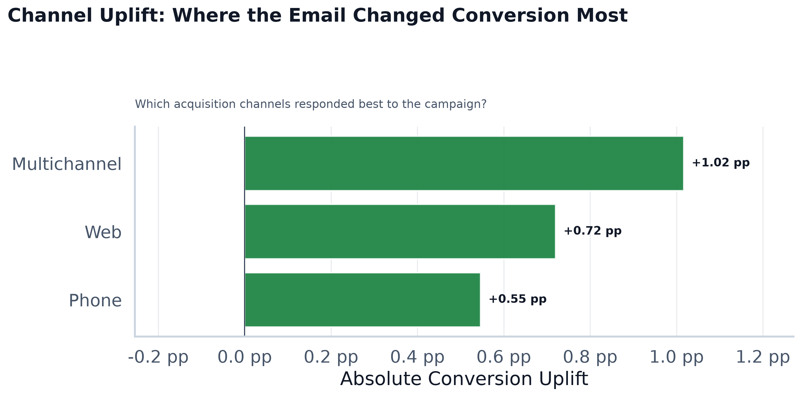
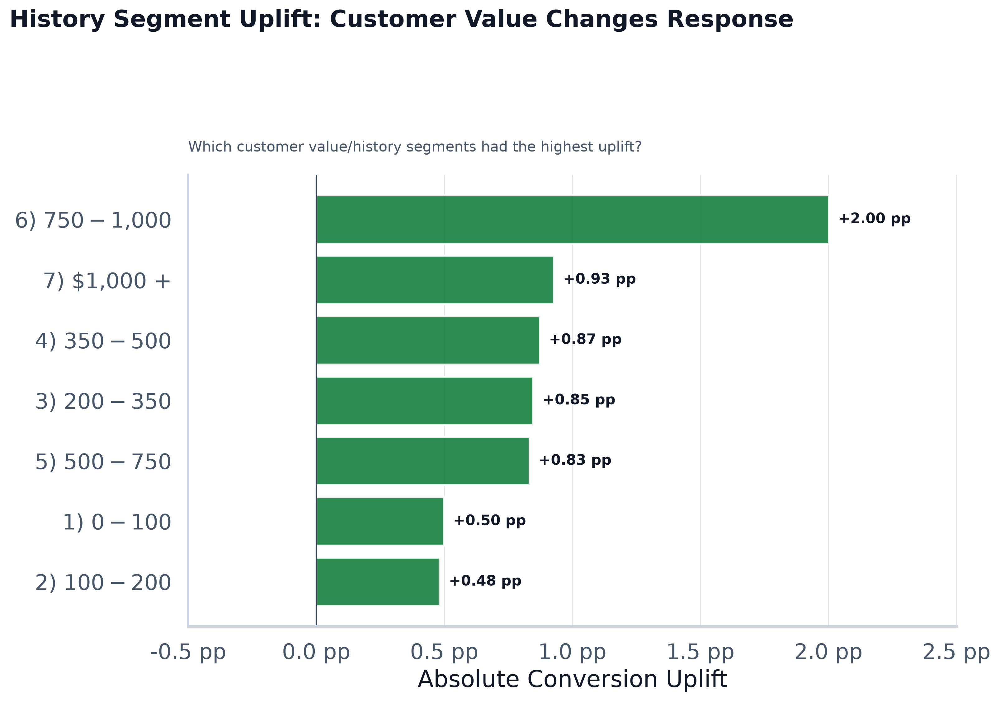
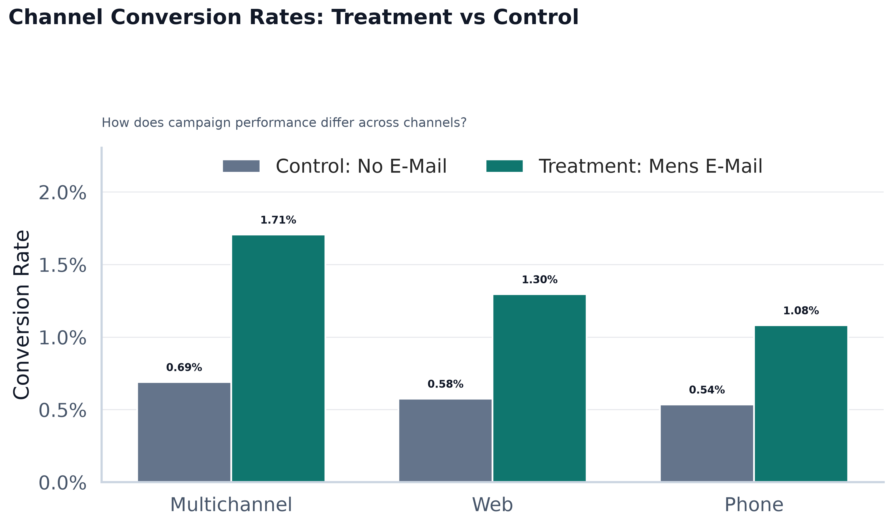
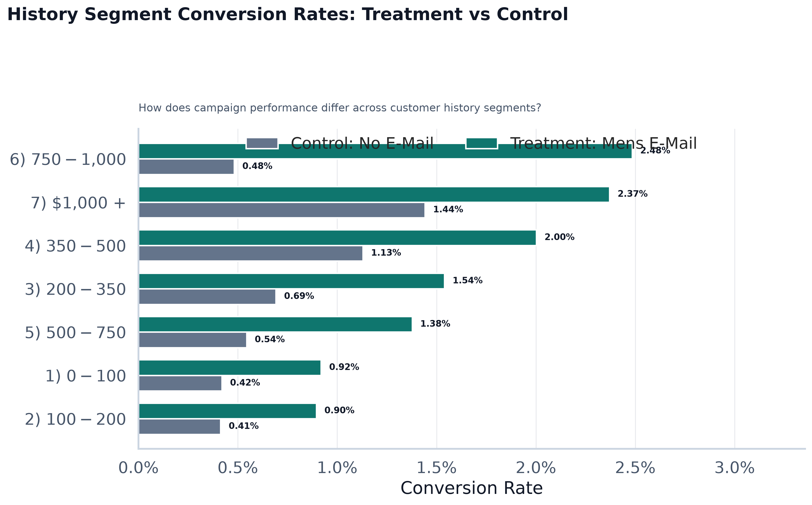
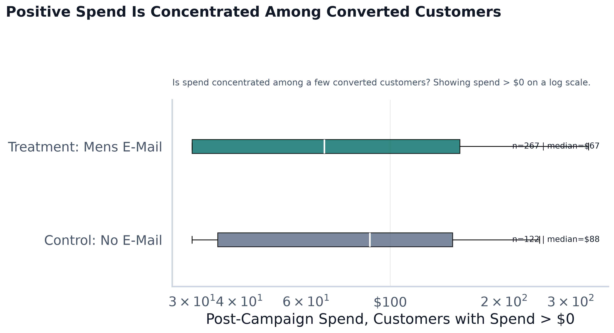

# Hillstrom Email Marketing EDA Summary

## Dataset Overview

The processed Hillstrom dataset contains 42,613 customers and 14 columns. This first analysis compares customers who received the Mens E-Mail campaign against customers who received No E-Mail.

- Treatment group: Mens E-Mail
- Control group: No E-Mail
- Main outcome: conversion
- Overall conversion rate: 0.91%
- Overall visit rate: 14.45%
- Average spend: $1.04

## Executive Summary

The KPI snapshot summarizes the causal comparison at the center of this project: customers exposed to the Mens E-Mail campaign converted at 1.25%, compared with 0.57% in the no-email holdout group. The absolute conversion uplift is 0.68 percentage points.

## Treatment vs Control Comparison

| Group | Customers | Conversion Rate | Visit Rate | Average Spend | Total Spend |
|---|---:|---:|---:|---:|---:|
| Control: No E-Mail | 21,306 | 0.57% | 10.62% | $0.65 | $13,908.33 |
| Treatment: Mens E-Mail | 21,307 | 1.25% | 18.28% | $1.42 | $30,311.69 |

The experiment is balanced between treatment and control, which makes the comparison more credible than simply comparing customers selected by a predictive model.

The treatment group converted at a higher rate than the control group. This is the first evidence that the email created incremental behavior change, not just observed purchase intent.

The treatment group also visited at a higher rate. This supports the idea that the campaign increased engagement before purchase.

Average spend was $1.42 for the treatment group and $0.65 for the control group. The treatment group spent $0.77 more per customer on average.

## Segment-Level Response

The channel uplift chart ranks acquisition channels by treatment-minus-control conversion lift. This shows that campaign response is not necessarily uniform across customer acquisition paths.

The history segment uplift chart compares customer value/history bands. Some customer groups respond more strongly than others, which is exactly the kind of variation an uplift model is designed to learn.

The channel comparison chart shows treatment and control conversion rates side by side. This keeps the analysis anchored to the experimental design instead of only ranking high-converting groups.

The history segment comparison chart shows where conversion differences are strongest across customer value bands.

## Spend Concentration

Positive spend is concentrated among a relatively small group of converted customers. The chart uses a log scale for spend greater than zero so typical purchase values remain readable despite skew.

## Key Business Interpretation

The campaign appears to change customer behavior at the group level when compared with the no-email control group. This matters because campaign targeting should focus on incremental impact, not only on customers who already look likely to buy.

## Why Normal ML Is Not Enough

A normal purchase prediction model would estimate who is likely to convert. That is useful, but it does not tell us whether the email caused the conversion. High-probability customers may have purchased anyway, while some lower-probability customers may be highly persuadable.

## Why Uplift Modeling Is the Next Step

The next step is uplift modeling, which estimates how each customer's outcome changes because of treatment. The segment charts show why this matters: different groups can have different treatment effects, so the best targeting strategy should prioritize incremental lift rather than raw conversion probability.
