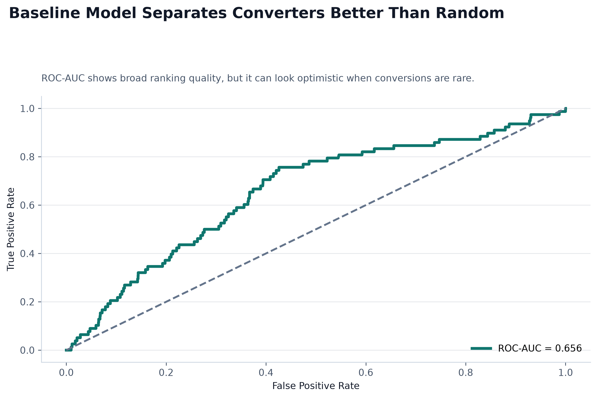
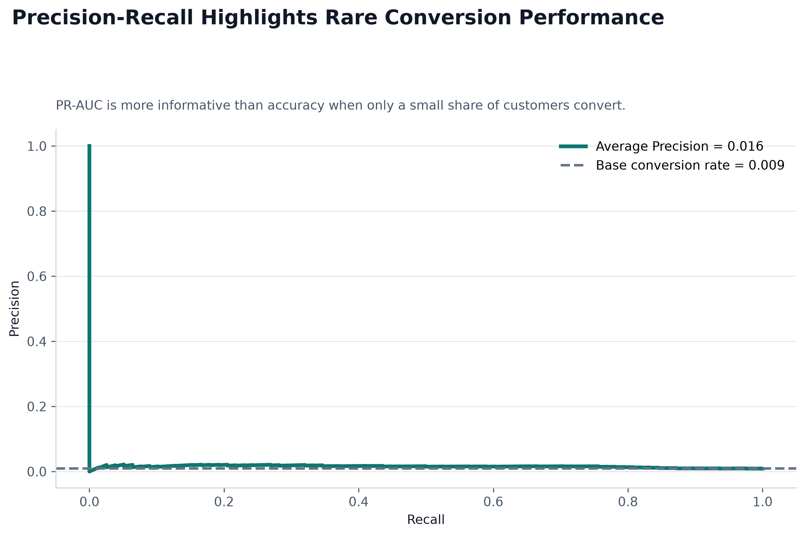
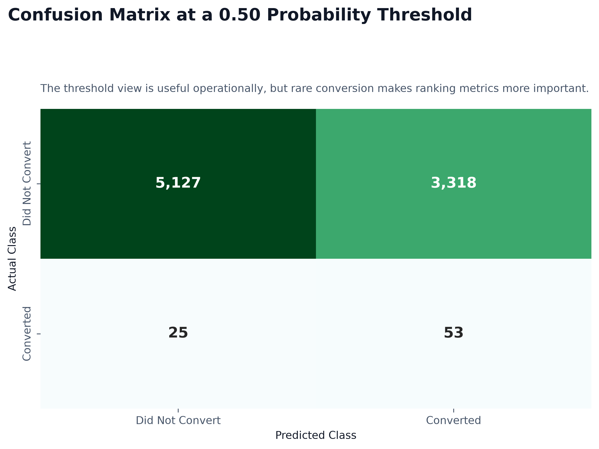
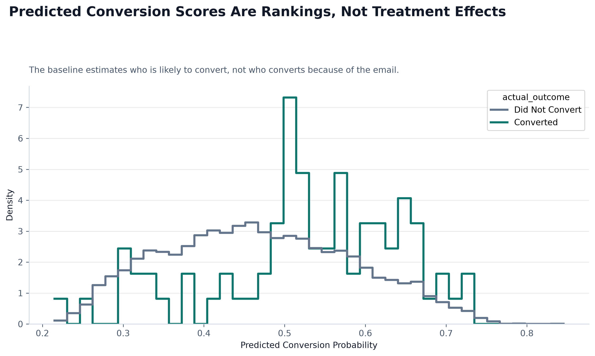
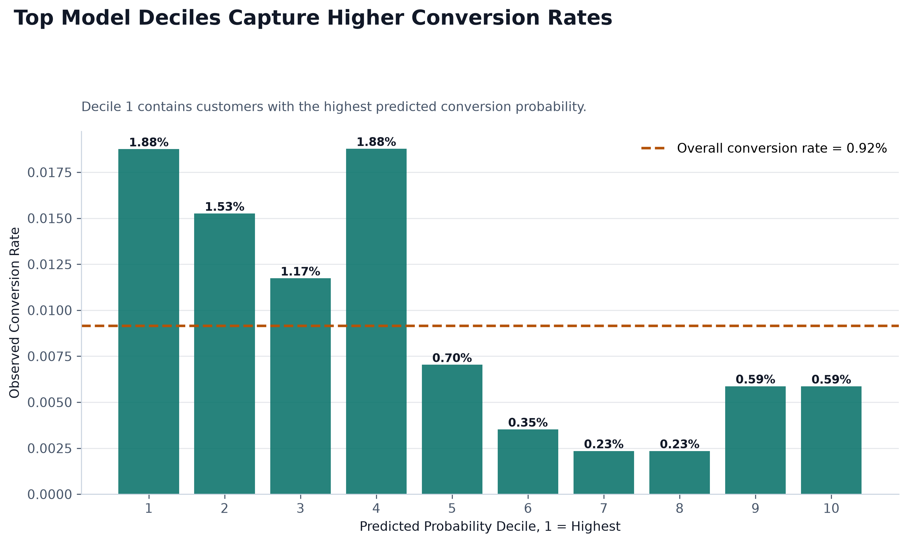

# Baseline Conversion Model Summary

## What This Model Predicts

The baseline model predicts each customer's probability of conversion using only pre-campaign customer features. It answers: who is likely to convert?

It does not answer whether the Mens E-Mail campaign caused the customer to convert.

## Features Used

Numeric features:

- recency, history, mens, womens, newbie

Categorical features:

- history_segment, zip_code, channel

Treatment assignment was excluded because this baseline is a normal conversion prediction model, not an uplift model. Post-campaign columns such as `visit`, `conversion`, and `spend` were also excluded to avoid leakage.

## Model Comparison

| Model | ROC-AUC | Average Precision | Accuracy | Precision | Recall | F1 |
|---|---:|---:|---:|---:|---:|---:|
| Logistic Regression | 0.656 | 0.016 | 0.608 | 0.016 | 0.679 | 0.031 |
| Random Forest | 0.551 | 0.011 | 0.959 | 0.011 | 0.038 | 0.017 |

The selected model is **Logistic Regression**, chosen by Average Precision.

## Key Metrics

- ROC-AUC: 0.656
- Average Precision / PR-AUC: 0.016
- Accuracy at threshold 0.50: 0.608
- Precision at threshold 0.50: 0.016
- Recall at threshold 0.50: 0.679
- F1 at threshold 0.50: 0.031

Accuracy is misleading here because conversions are rare. A model can look accurate by mostly predicting non-conversion. Average Precision is more useful because it focuses on how well the model ranks likely converters.

## Decile Lift

The decile table ranks customers by predicted conversion probability. Decile 1 contains the highest-scored customers. In the test set, decile 1 had 16 conversions among 853 customers, a conversion rate of 1.88%. The overall test-set conversion rate was 0.92%.

## Charts

## Limitation

This model predicts likelihood to convert. It does not estimate incremental uplift caused by the email. A high-scoring customer may have converted without receiving the campaign, while a lower-scoring customer may be highly persuadable.

## Why Uplift Modeling Is Next

The next step is to model the difference between expected outcomes with treatment and without treatment. That uplift-focused view is what turns normal conversion prediction into smarter campaign targeting.
