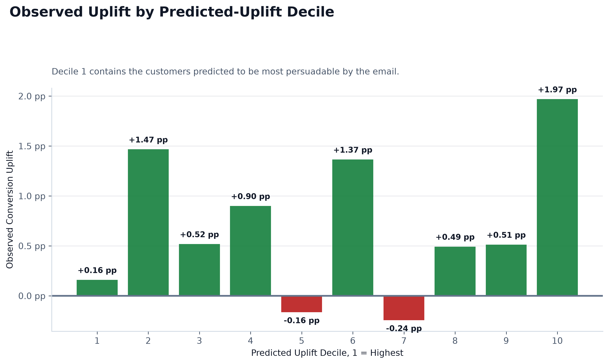
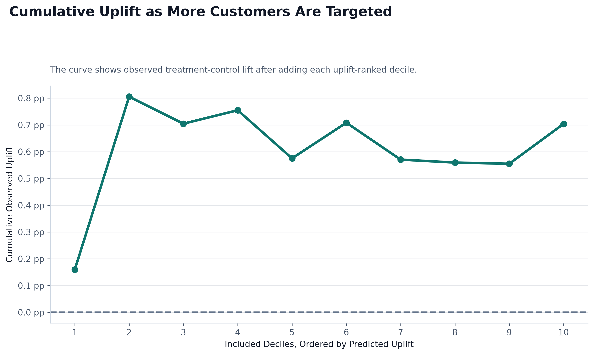
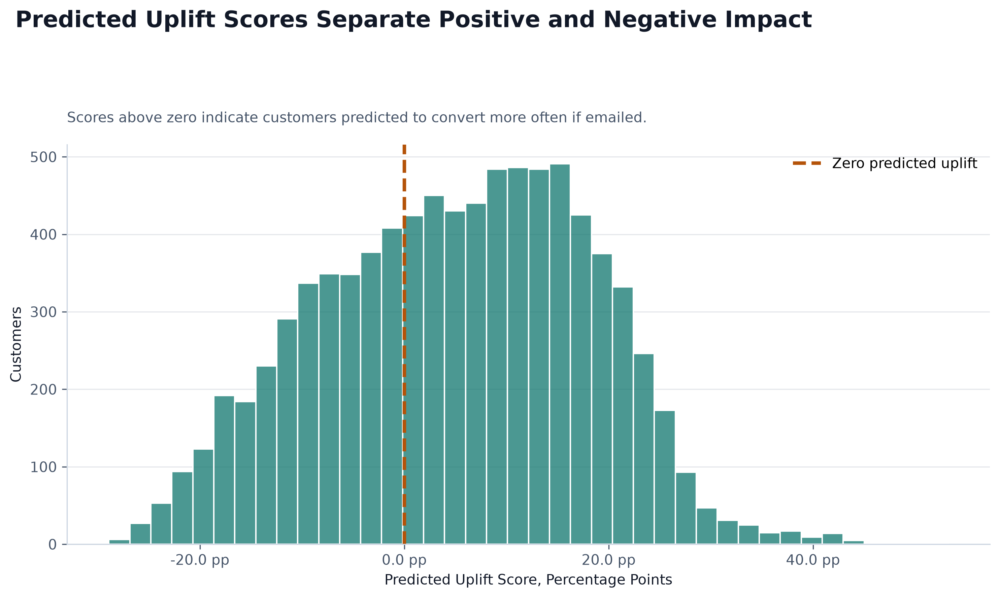
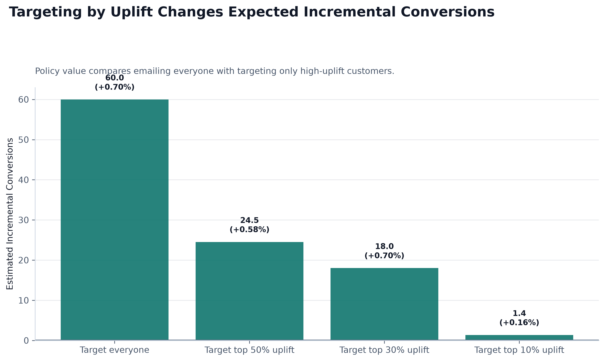
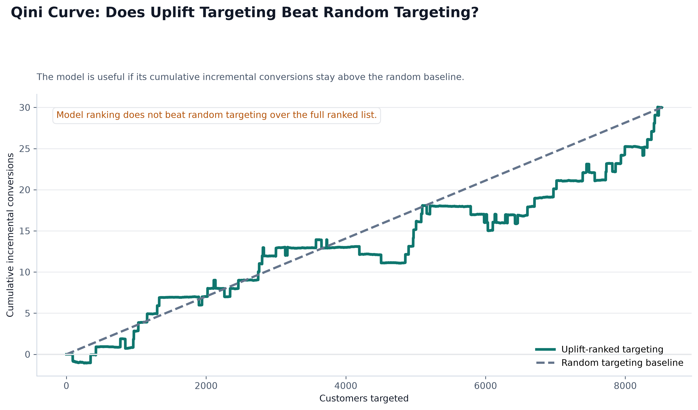
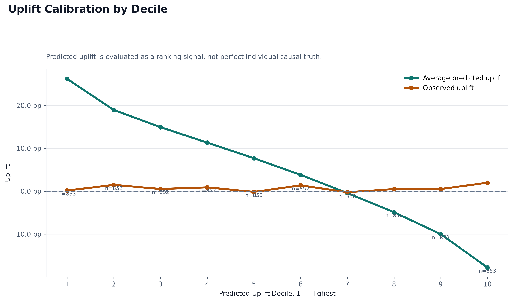

# Uplift Modeling Summary

## What Uplift Modeling Means

Uplift modeling estimates the incremental effect of treatment. In this project, the treatment is receiving the Mens E-Mail campaign, and the uplift score is:

`P(conversion | treated) - P(conversion | control)`

The goal is to rank customers by expected incremental conversion, not just by overall conversion probability.

## Baseline Conversion Model vs Uplift Model

The baseline conversion model predicts who is likely to convert. The uplift model asks a different question: who is likely to convert because of the email? This distinction matters because high-probability customers may have purchased even without the campaign.

## Learners Implemented

The **T-Learner** trains two separate models: one on treated customers and one on control customers. Uplift is the difference between those two predicted probabilities.

The **S-Learner** trains one model with treatment included as a feature. It estimates uplift by scoring each customer twice: once as treated and once as control.

## Model Comparison

| Model | Top Decile Observed Uplift | Avg Predicted Uplift | Top 30% Customers | Top 30% Incremental Rate | Top 30% Incremental Conversions | Qini Coefficient | Selected |
|---|---:|---:|---:|---:|---:|---:|---:|
| T-Learner | 0.16% | 4.97% | 2,557 | 0.70% | 18.0 | -1.936 | Yes |
| S-Learner | 1.10% | 19.57% | 2,557 | 0.01% | 0.2 | -1.818 | No |

Top-decile observed uplift is useful because it checks whether the highest-ranked customers show stronger treatment response. However, conversion is rare, so one decile can be noisy. For campaign targeting, the selected model is **T-Learner** because it produced the highest estimated incremental conversions when targeting the top 30% uplift-ranked customers.

Selection metric:

- Primary: top 30% estimated incremental conversions = 18.0
- Tie-breaker: top-decile observed uplift = 0.16%
- Qini coefficient: -1.936

## Top Uplift Decile

The top decile contains the customers predicted to be most persuadable by the email. For the selected model, the observed uplift in decile 1 was 0.16%. This is directionally useful, but it should not be the only selection metric because rare conversions make small slices of the test set volatile. The full dataset observed ATE was 0.68%.

## Targeting Top 30% Uplift Users

Targeting the top 30% uplift-ranked users reaches 2,557 customers in the test set, including 1,278 treated customers and 1,279 control customers. The observed incremental conversion rate inside that targeted group is 0.70%, which corresponds to an estimated 18.0 incremental conversions.

This top-30% policy value is more business-stable than a single top decile because it evaluates a larger campaignable audience. It better reflects the question a marketing team would ask: how many incremental conversions can we expect if we target a realistic share of customers?

## Qini Curve and Random Targeting Baseline

The Qini curve evaluates whether ranking customers by predicted uplift beats random targeting. It compares cumulative incremental conversions from the model-ranked list against the expected incremental conversions from randomly targeting the same share of customers. The selected model's approximate Qini coefficient is -1.936.

## Uplift Calibration

The calibration table compares average predicted uplift against observed uplift by decile. The mean absolute calibration gap across deciles is 11.45%. This diagnostic checks whether predicted uplift magnitude is aligned with observed treatment-control differences, not just whether the model ranks customers well.

## Interpreting Predicted Uplift Scores

Predicted uplift scores are mainly used for ranking customers, not as perfectly calibrated causal probabilities. Class imbalance and probability calibration can make raw predicted uplift values larger than the validated campaign-level ATE. Interpretation should focus on rank ordering, decile performance, Qini gain, and policy value rather than taking every individual uplift score literally.

Observed/validated ATE is the campaign-level effect. The uplift model predicts heterogeneous response so the business can rank customers for targeting.

## Observed ATE Confidence Interval

The observed ATE is 0.68%, with a 95% confidence interval from 0.50% to 0.86%. The two-proportion z-test p-value is 0.0000.

## Charts

## Important Limitation

Individual counterfactual outcomes are not directly observed. We never see the same customer both receiving and not receiving the email at the same time. These uplift estimates rely on the randomized treatment-control structure and model assumptions.

## Why Causal Validation Is Next

The next step is causal validation and more robust treatment-effect interpretation with tools such as DoWhy. That step makes assumptions explicit, tests robustness, and strengthens the argument that the estimated uplift reflects campaign impact rather than model calibration artifacts.
